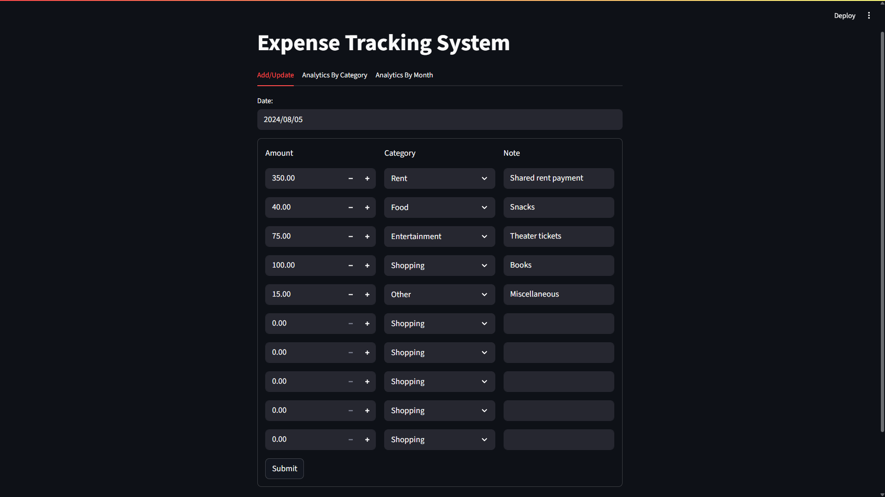
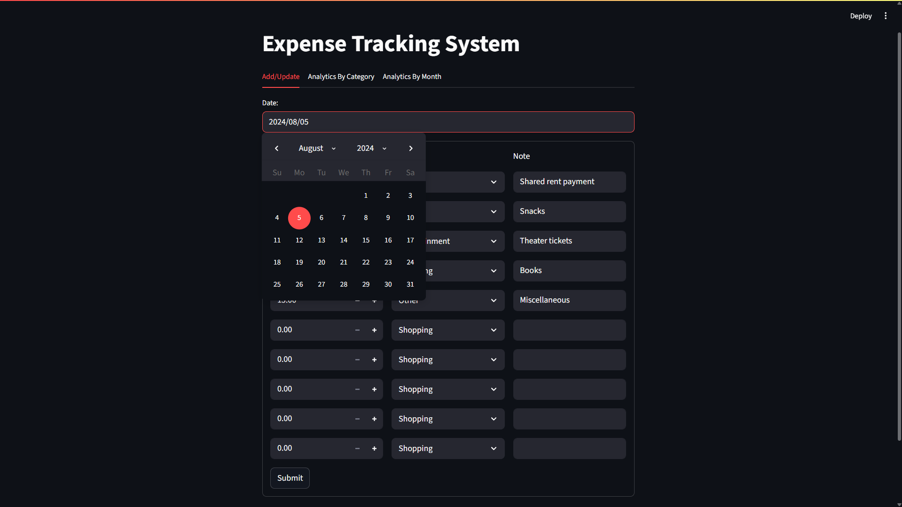
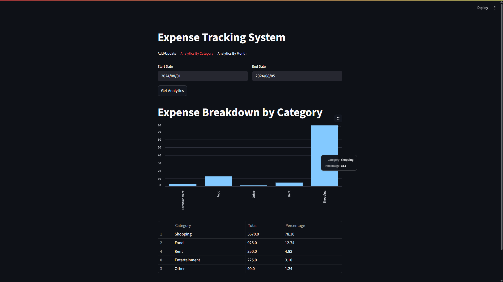
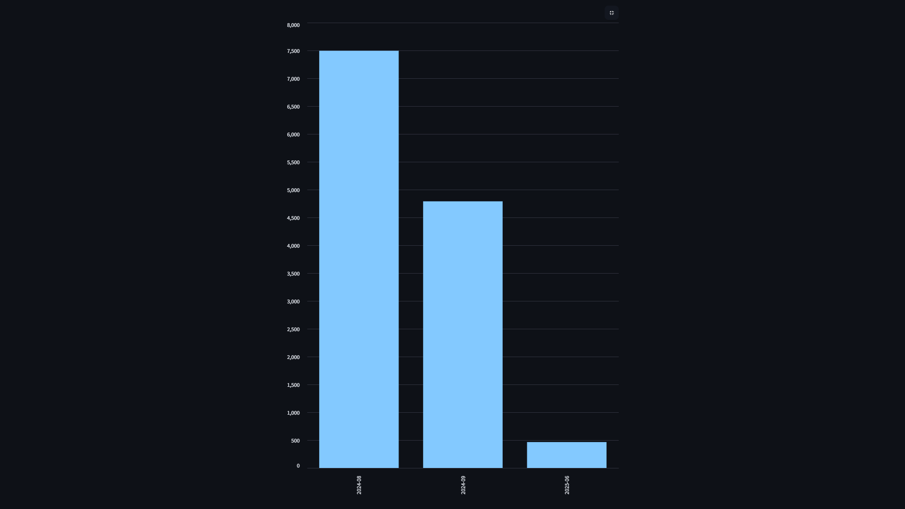
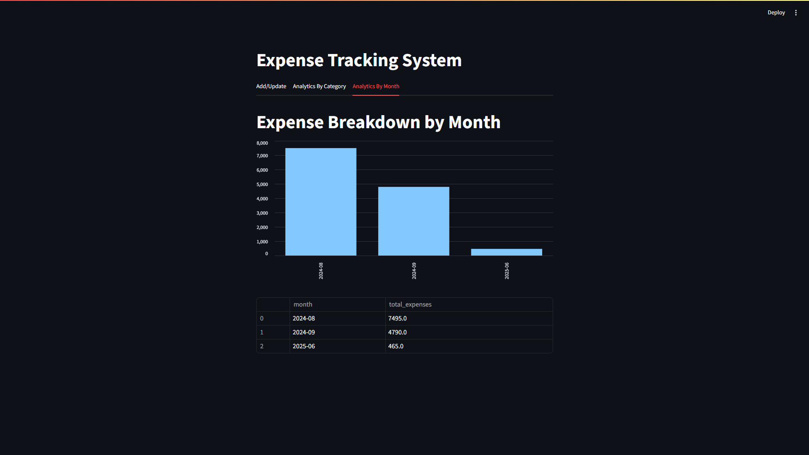

# 📊 Expense Tracking System

A sleek, full-stack application designed to help you effortlessly track and analyze your personal expenses. Built with a powerful FastAPI backend and an intuitive Streamlit frontend.


---

## ✨ Key Features & Previews

This application provides a seamless experience for managing your finances. Below is a walkthrough of its core features.

### 1. Add and Update Daily Expenses

The core of the application is the `Add/Update` tab. Here, you can select any date and log up to 10 expense entries for that day. The form intelligently pre-fills with existing data, making updates quick and easy.

<p align="center">
  
</p>

The intuitive calendar makes date selection a breeze.

<p align="center">
  
</p>

### 2. Analyze Spending by Category

Curious where your money is going? The `Analytics By Category` tab provides a powerful breakdown. Select a start and end date to generate a dynamic bar chart and a detailed table showing total spending and percentage for each category.

<p align="center">
  
</p>

Hover over the bars to see precise details or expand the chart for a larger view.

<p align="center">
  
</p>
<p align="center">
  
</p>

### 3. Track Monthly Trends

To understand your long-term spending habits, the `Analytics By Month` tab aggregates all your expenses and displays the total for each month. This is perfect for spotting trends and planning your budget.

<p align="center">
  
</p>

---

## 🛠️ Tech Stack

-   **Backend:** FastAPI, Uvicorn
-   **Frontend:** Streamlit
-   **Database:** MySQL
-   **Core Libraries:** Pandas, `mysql-connector-python`, Pydantic, Requests

---

## ⚙️ Setup and Installation

Follow these steps to get the project running on your local machine.

### 1. Prerequisites
- Python 3.8+
- An active MySQL Server instance.

### 2. Clone the Repository
```bash
git clone https://github.com/spj114/Expense-Tracker.git
cd Expense-Tracker
